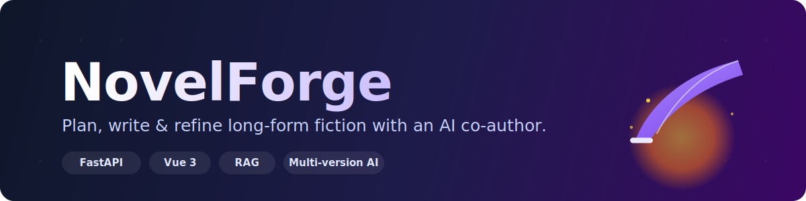
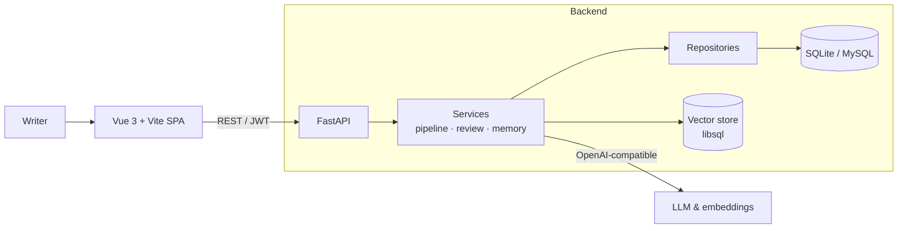

<p align="center">
  
</p>

<h1 align="center">NovelForge</h1>

<p align="center">
  <b>An AI-assisted studio for planning, writing, and refining long-form fiction.</b><br>
  Self-hosted · works with any OpenAI-compatible model · keeps your story consistent across hundreds of chapters.
</p>

<p align="center">
  <a href="https://github.com/all666666all/AI-novel/actions/workflows/ci.yml"></a>
  <a href="LICENSE"></a>
  
  
  
  
</p>

---

## What is NovelForge?

Writing a novel isn't blocked by typing — it's blocked by **keeping everything straight**. What color were the deuteragonist's eyes? How many tiers does the magic system have? What was supposed to happen in chapter 37?

NovelForge is a **co-author, not an autocomplete**. It remembers your world, tracks your characters and foreshadowing, drafts chapters from your outline, and gives you **multiple versions to choose from** so the prose stays yours. Bring your own model — anything that speaks the OpenAI API works.

## ✨ Features

- 📖 **World & character bible** — characters, factions, locations, and relationships in one place, reused as context so the story never contradicts itself.
- 🧵 **Concept → outline → chapters** — turn a loose idea into a structured blueprint, then expand it chapter by chapter.
- ✍️ **Multi-version drafting** — generate several takes per chapter and keep the one that fits your voice.
- 🔎 **Consistency & review** — a multi-dimension AI reviewer, self-critique, and a reader simulator flag plot holes, POV leaks, and pacing issues before you commit.
- 🧶 **Foreshadowing tracker** — plant setups and get reminded to pay them off.
- 📈 **Emotion & pacing analytics** — visualize the emotional curve across the arc.
- 🧠 **Long-context memory (RAG)** — chapters are embedded into a vector store so earlier events stay retrievable hundreds of pages later.
- 🪄 **Layered optimizer** — refine dialogue, psychology, environment, and rhythm as separate passes.
- 💡 **Inspiration mode** — brainstorm conversationally when you're stuck.
- 🛠️ **Admin console** — manage users, editable prompt templates, system config, usage stats, and covers.

## 🏗️ Architecture



**Tech stack**

| Layer    | Technology |
|----------|------------|
| Frontend | Vue 3, Vite, TypeScript, Pinia, Vue Router, Tailwind CSS v4, Naive UI |
| Backend  | Python, FastAPI, SQLAlchemy (async), Pydantic v2 |
| Storage  | SQLite (default) or MySQL · libsql vector store for RAG |
| AI       | Any OpenAI-compatible chat & embedding API (OpenAI, Azure, local, …) |
| Deploy   | Docker + Docker Compose (nginx + uvicorn via supervisor) |

The backend follows a clean **API → service → repository → model** layering. See [`docs/ARCHITECTURE.md`](docs/ARCHITECTURE.md) and [`docs/PIPELINE.md`](docs/PIPELINE.md) for details.

## 🚀 Quick start (Docker)

```bash
git clone https://github.com/all666666all/AI-novel.git
cd AI-novel

cp .env.example .env
# Edit .env and set at least:
#   SECRET_KEY        — any long random string
#   OPENAI_API_KEY    — your LLM API key

docker compose up -d
```

Open **http://localhost:8080** and log in with the bootstrap admin from your `.env`
(`ADMIN_DEFAULT_USERNAME` / `ADMIN_DEFAULT_PASSWORD`). SQLite is the default — no database to install.

Prefer MySQL? Bundle one with a profile:

```bash
docker compose --profile mysql up -d   # set DB_PROVIDER=mysql in .env first
```

## 🧑‍💻 Local development

**Backend** (Python 3.11+):

```bash
cd backend
python -m venv .venv && source .venv/bin/activate   # Windows: .venv\Scripts\activate
pip install -r requirements.txt
cp ../.env.example .env                              # set SECRET_KEY & OPENAI_API_KEY
uvicorn app.main:app --reload                        # http://127.0.0.1:8000  (docs at /docs)
```

> MySQL is optional. Only if you set `DB_PROVIDER=mysql`: `pip install -r requirements-mysql.txt`.

**Frontend** (Node 20+):

```bash
cd frontend
npm install
npm run dev        # http://127.0.0.1:5173
```

## ⚙️ Configuration

All settings come from environment variables (see [`.env.example`](.env.example) for the full list). The essentials:

| Variable | Required | Default | Description |
|----------|:--------:|---------|-------------|
| `SECRET_KEY` | ✅ | — | Secret used to sign JWTs |
| `OPENAI_API_KEY` | ✅ | — | LLM API key (OpenAI-compatible) |
| `OPENAI_API_BASE_URL` | | `https://api.openai.com/v1` | Point this at any compatible provider |
| `OPENAI_MODEL_NAME` | | `gpt-4o-mini` | Default chat model |
| `DB_PROVIDER` | | `sqlite` | `sqlite` or `mysql` |
| `WRITER_CHAPTER_VERSION_COUNT` | | `2` | Draft candidates generated per chapter |
| `ALLOW_USER_REGISTRATION` | | `false` | Open self-service sign-up |
| `ADMIN_DEFAULT_PASSWORD` | | `ChangeMe123!` | **Change before deploying** |

## 🗺️ Project structure

```
AI-novel/
├── backend/            # FastAPI service
│   ├── app/
│   │   ├── api/        # Routers (HTTP layer)
│   │   ├── services/   # Business logic (pipeline, review, memory, RAG)
│   │   ├── repositories/  # Data access
│   │   ├── models/     # SQLAlchemy ORM models
│   │   ├── schemas/    # Pydantic request/response models
│   │   └── core/       # Config, security, dependencies
│   ├── prompts/        # Prompt templates (seeded into the DB on first boot)
│   └── tests/          # pytest suite
├── frontend/           # Vue 3 + Vite SPA
├── deploy/             # Dockerfile, nginx, supervisor, entrypoint
├── docs/               # Architecture & pipeline docs
└── docker-compose.yml  # One-command deployment
```

## 🧪 Tests

```bash
cd backend
pip install -r requirements.txt -r requirements-dev.txt
PYTHONPATH=. pytest tests -q
```

The frontend type-check + build doubles as its CI gate:

```bash
cd frontend && npm run build
```

Both run automatically on every push via [GitHub Actions](.github/workflows/ci.yml).

## 🤝 Contributing

Issues and PRs are welcome — see [CONTRIBUTING.md](CONTRIBUTING.md). In short: keep the CI green (`pytest` + `npm run build`) and match the surrounding code style.

## 🙏 Acknowledgements

NovelForge builds on ideas and groundwork from several open-source projects:

- [arboris-novel](https://github.com/t59688/arboris-novel) & [novel-kit](https://github.com/t59688/novel-kit) by [@t59688](https://github.com/t59688)
- [AI_NovelGenerator](https://github.com/YILING0013/AI_NovelGenerator) by [@YILING0013](https://github.com/YILING0013)

Huge thanks to their authors and contributors.

## 📄 License

[MIT](LICENSE) © NovelForge contributors

<p align="center"><sub>Built for writers who want a partner, not a replacement.</sub></p>
