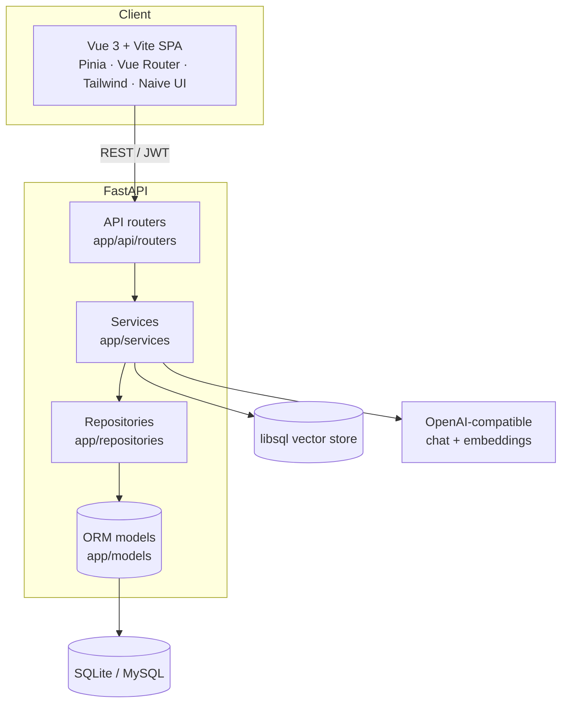

# Architecture

NovelForge is a single-page Vue app talking to a FastAPI backend over a JSON/REST API
secured with JWTs. The backend is organized in clean layers and is storage-agnostic
(SQLite or MySQL) with an optional libsql vector store for retrieval.

## Backend layers

| Layer | Location | Responsibility |
|-------|----------|----------------|
| **API** | `app/api/routers/` | HTTP endpoints, request/response validation, auth dependencies. No business logic. |
| **Services** | `app/services/` | Business logic: the writing pipeline, review, memory/RAG, optimization, analytics. |
| **Repositories** | `app/repositories/` | Data access; isolates SQLAlchemy queries from services. |
| **Models** | `app/models/` | SQLAlchemy ORM tables. |
| **Schemas** | `app/schemas/` | Pydantic models for I/O. |
| **Core** | `app/core/` | Settings (`config.py`), security (JWT/hashing), shared dependencies. |

### Notable services

- **`pipeline_orchestrator`** — coordinates concept → blueprint → chapter generation.
- **`writer_context_builder` / `chapter_context_service`** — assemble blueprint, prior-chapter
  bridge, and RAG results into the writing prompt.
- **`vector_store_service` / `embedding_service` / `chapter_ingest_service`** — the RAG layer.
- **`ai_review_service` / `six_dimension_review_service` / `self_critique_service` /
  `reader_simulator_service`** — layered quality review.
- **`finalize_service`** — commits the selected version, snapshots state, updates memory & vectors.
- **`foreshadowing_service` / `consistency_service` / `constitution_service`** — narrative
  integrity guards.

## Startup & data flow

On boot (`app.main:lifespan`) the backend:

1. Ensures the database exists and creates all tables from the ORM models
   (`init_db` → `Base.metadata.create_all`).
2. Seeds a bootstrap admin and default system config.
3. Seeds prompt templates from `backend/prompts/*.md` into the `prompts` table (editable later
   from the admin UI).
4. Pre-warms the prompt cache.

Prompts therefore live in version control **and** in the database — files are the defaults,
the DB copy is what runs and what admins can tune live.

## Storage

- **Relational** — SQLAlchemy async engine. `DB_PROVIDER=sqlite` (default, zero-config) or
  `mysql`. The MySQL driver (`asyncmy`) is an optional install.
- **Vector** — libsql via `VECTOR_DB_URL`. When unset, RAG features degrade gracefully and the
  rest of the app keeps working.

## Frontend

A Vite-built Vue 3 SPA (TypeScript). State in Pinia (`stores/`), routing with route guards in
`router/index.ts`, styling with Tailwind CSS v4 and Naive UI. API clients live in `src/api/`.
Major surfaces: workspace entry, blueprint editor, the writing desk, novel detail, inspiration
mode, and the admin console.

## Deployment

The production image (`deploy/Dockerfile`) is multi-stage: build the frontend, then serve the
static bundle via **nginx** and the API via **uvicorn**, both supervised by **supervisor** in a
single container. `docker-compose.yml` wires it together with optional MySQL.
See [`PIPELINE.md`](PIPELINE.md) for the generation flow.
